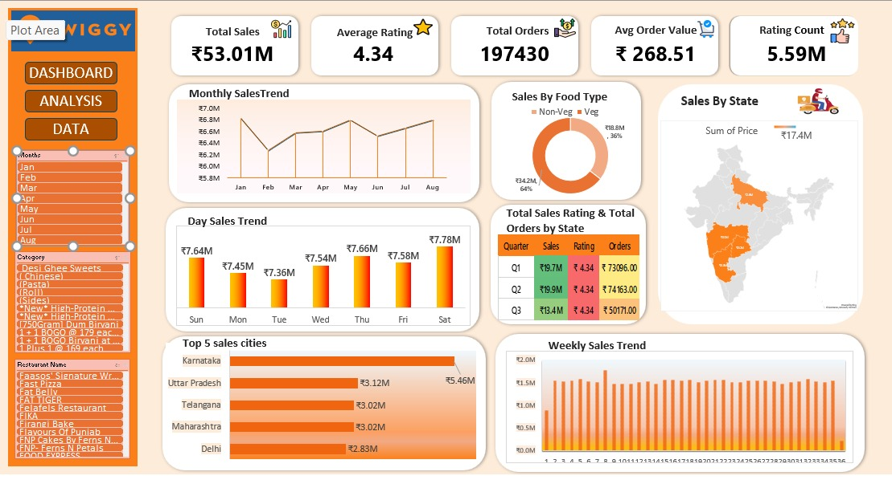

📊 Swiggy Sales Dashboard (Excel)
📥 Download Excel File: [Download Dashboard](httyps://raw.githubusercontent.com/mathurhimika3012-rgb/Swiggy-Dashboard/main/Swiggy%20Dashboard.xlsx)
📌 Overview

This project is an interactive Excel dashboard built to analyze Swiggy sales data. It provides insights into sales performance, customer behavior, and business trends using data visualization techniques.

---

📷 Dashboard Preview

---

🔍 Key Features

- 📈 Total Sales Analysis (₹53.01M)
- ⭐ Average Rating Tracking (4.34)
- 📦 Total Orders Analysis (197K+)
- 💰 Average Order Value (₹268.51)
- 📊 Monthly & Weekly Sales Trends
- 🍽️ Food Category Distribution (Veg vs Non-Veg)
- 🗺️ State-wise Sales Analysis
- 🏆 Top Performing Cities

---

🛠 Tools & Skills Used

- Microsoft Excel
- Pivot Tables
- Pivot Charts
- Slicers & Filters
- Data Visualization
- Dashboard Design

---

📊 Insights Gained

- Identified top-performing states and cities
- Analyzed customer preferences across food categories
- Observed sales trends over time
- Evaluated business performance using KPIs

---

🎯 Use Case

This dashboard can be used for:

- Business decision-making
- Data analysis practice
- Portfolio projects for students

---

👩‍💻 Author

Himika Mathur
📧 mathurhimika3012@gmail.com
🔗 LinkedIn: https://www.linkedin.com/in/himikamathur30/
💻 GitHub: https://github.com/mathurhimika3012-rgb

---

⭐ Support

If you like this project, feel free to ⭐ star the repository!
